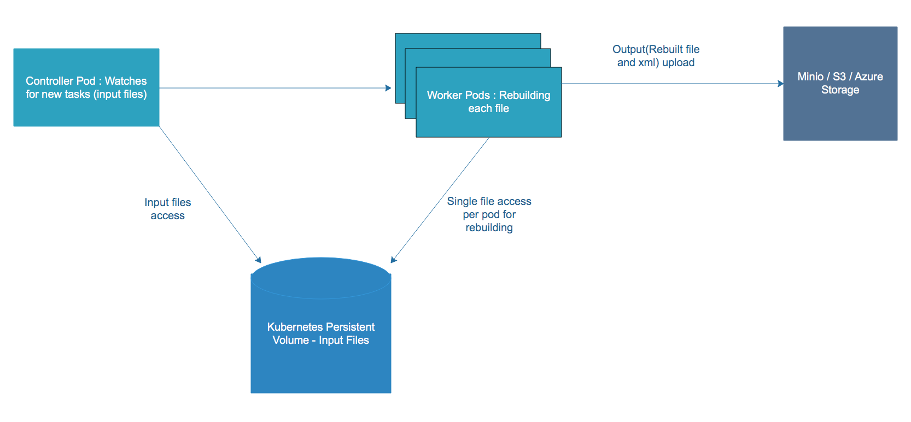

# Glasswall Rebuild

## Achitecture overview



Pod List
----------
```
kubectl -n test get pods
NAME                                             READY   STATUS    RESTARTS   AGE
gw-controller-6b786f67cd-rb5d6                   1/1     Running   0          75m
rebuild-1-541d95bd-26bb-493f-96aa-7b169066a6e9   1/1     Running   0          75m
rebuild-2-541d95bd-26bb-493f-96aa-7b169066a6e9   1/1     Running   0          75m
rebuild-3-541d95bd-26bb-493f-96aa-7b169066a6e9   1/1     Running   0          75m
rebuild-4-541d95bd-26bb-493f-96aa-7b169066a6e9   1/1     Running   0          75m
```

PS : I intensionnally added for loop and unlimited sleep to keep the pods running. But the target is to not have them and the pod would be completed.

Controller logs
--------------
```
2020/08/24 09:13:32 init worker
2020/08/24 09:13:32 init worker
2020/08/24 09:13:32 init worker
2020/08/24 09:13:32 init worker
2020/08/24 09:13:32 init worker
2020/08/24 09:13:32 Scan processor on folder /tmp/files
2020/08/24 09:13:32 File found : Complete+works+of+shakespeare+hidden+zip_Polyglot_image.jpg
2020/08/24 09:13:32 File found : MacroRunCalculator.docm
2020/08/24 09:13:32 File found : Opens+calculator+app_macro_MS+excel+2003+and+later.xlsm
2020/08/24 09:13:32 File found : PDF_with_javascript.pdf
2020/08/24 09:13:32 Processing file : PDF_with_javascript.pdf
2020/08/24 09:13:32 Processing file : Complete+works+of+shakespeare+hidden+zip_Polyglot_image.jpg
2020/08/24 09:13:32 Processing file : MacroRunCalculator.docm
2020/08/24 09:13:32 Processing file : Opens+calculator+app_macro_MS+excel+2003+and+later.xlsm
```

A rebuild Pod Log
------
```
*************************************************************
START LOGGING Mon Aug 24 09:13:37 2020

SOFTWARE VERSION 1.99
*************************************************************
*************************************************************
Process Settings
*************************************************************
*************************************************************
<?xml version="1.0" encoding="utf-8"?>
<config><pdfConfig><watermark>Glasswall Approved</watermark>
<metadata>sanitise</metadata>
<javascript>sanitise</javascript>
<acroform>sanitise</acroform>
<actions_all>sanitise</actions_all>
<embedded_files>sanitise</embedded_files>
<external_hyperlinks>sanitise</external_hyperlinks>
<internal_hyperlinks>sanitise</internal_hyperlinks>
<embedded_images>sanitise</embedded_images>
<value_outside_reasonable_limits>allow</value_outside_reasonable_limits>
<retain_exported_streams>allow</retain_exported_streams>
</pdfConfig>
<wordConfig><metadata>sanitise</metadata>
<macros>sanitise</macros>
<embedded_files>sanitise</embedded_files>
<review_comments>sanitise</review_comments>
<internal_hyperlinks>sanitise</internal_hyperlinks>
<external_hyperlinks>sanitise</external_hyperlinks>
<dynamic_data_exchange>sanitise</dynamic_data_exchange>
<embedded_images>sanitise</embedded_images>
</wordConfig>
<pptConfig><metadata>sanitise</metadata>
<macros>sanitise</macros>
<embedded_files>sanitise</embedded_files>
<review_comments>sanitise</review_comments>
<internal_hyperlinks>sanitise</internal_hyperlinks>
<external_hyperlinks>sanitise</external_hyperlinks>
<embedded_images>sanitise</embedded_images>
</pptConfig>
<xlsConfig><metadata>sanitise</metadata>
<macros>sanitise</macros>
<embedded_files>sanitise</embedded_files>
<internal_hyperlinks>sanitise</internal_hyperlinks>
<external_hyperlinks>sanitise</external_hyperlinks>
<review_comments>sanitise</review_comments>
<dynamic_data_exchange>sanitise</dynamic_data_exchange>
<embedded_images>sanitise</embedded_images>
</xlsConfig>
<tiffConfig><geotiff>sanitise</geotiff>
</tiffConfig>
</config>

*************************************************************
==00000== Found File /tmp/files/process-file-1/Complete+works+of+shakespeare+hidden+zip_Polyglot_image.jpg    Passed

*************************************************************
STOPLOGGING Mon Aug 24 09:13:37 2020

Duration  0hrs  0mins  0secs

*************************************************************
```


## Next Step
- Validate which sharing technique will be used ( nfs, s3, gcp persistent disk, etc)
- Implement the updates
- Plug CI/CD

